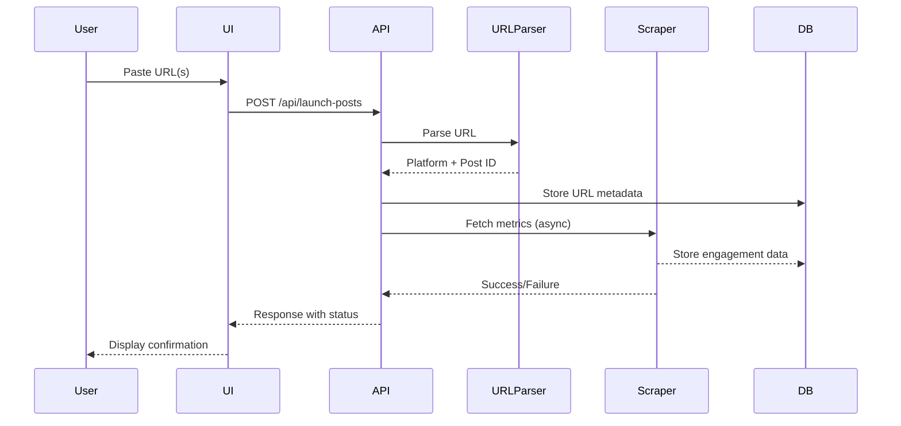
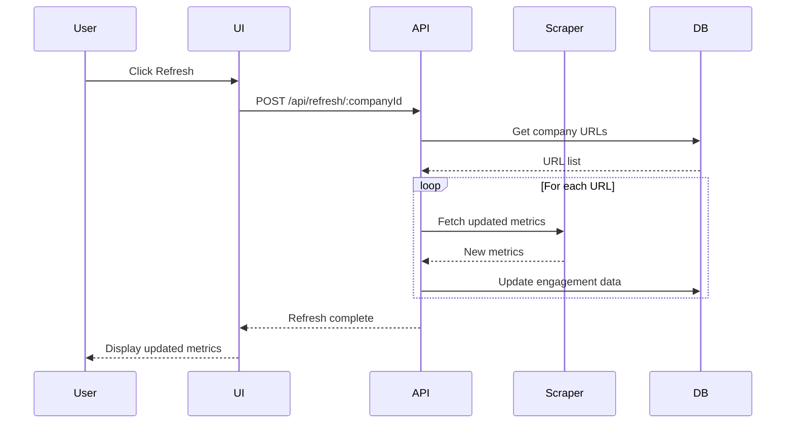
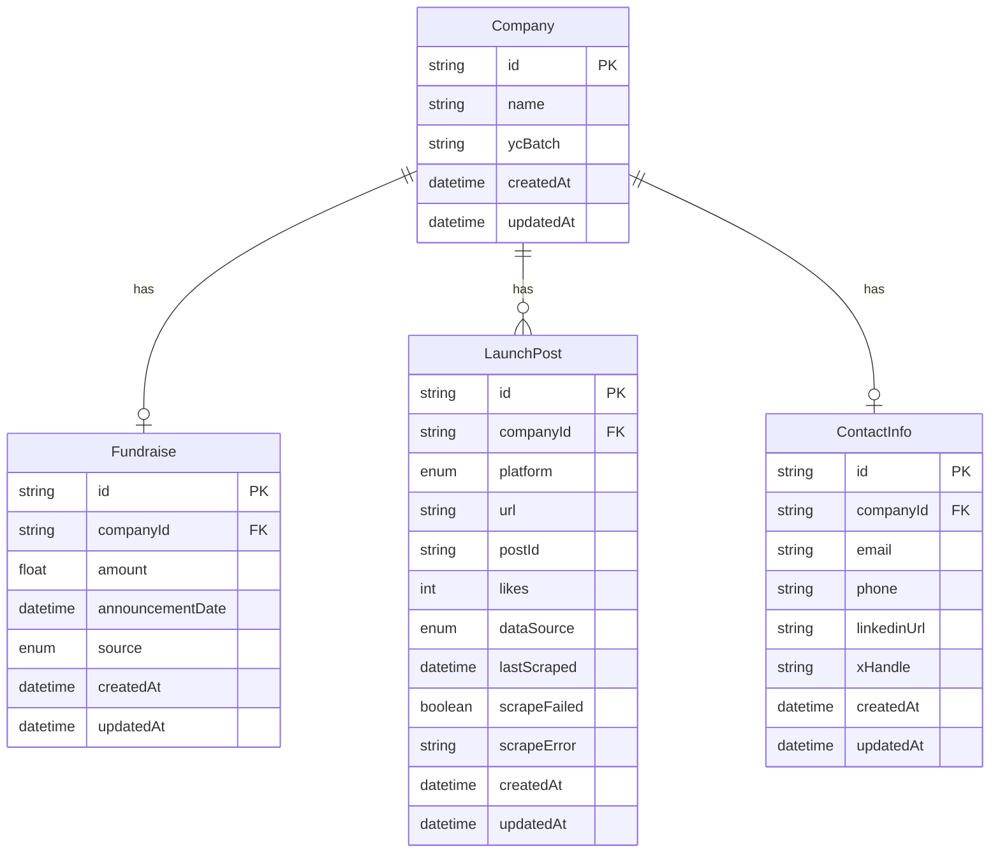
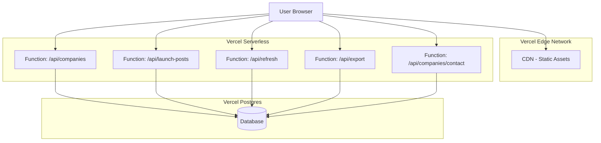

# Design Document: Launch Tracker Dashboard

## Overview

The Launch Tracker Dashboard is a zero-cost MVP web application that aggregates and displays company launch videos and fundraise announcements from multiple platforms. The system enables users to manually track launch performance metrics and identify companies with low engagement for outreach purposes.

### Core Objectives

- Provide a manual data entry interface for tracking launch posts from X (Twitter) and LinkedIn
- Fetch public engagement metrics using open-source scraping libraries (with ToS risk acknowledgment)
- Integrate with the free YCombinator API for fundraise data
- Display aggregated metrics in a responsive dashboard interface
- Generate outreach message drafts for low-engagement launches
- Support bulk URL imports and data export for demonstration purposes

### Technology Stack

**Frontend:**
- React 18 with Vite for fast development and optimized builds
- TanStack Query (React Query) for server state management and caching
- Tailwind CSS for responsive styling
- React Hook Form for form validation

**Backend:**
- Node.js with Express framework
- Deployed as Vercel serverless functions
- Axios for HTTP requests to external APIs

**Database:**
- Vercel Postgres (PostgreSQL-compatible)
- Prisma ORM for type-safe database access and migrations

**Scraping:**
- Puppeteer (lightweight mode) or Cheerio for HTML parsing
- Rate limiting with bottleneck library

**Deployment:**
- Vercel free tier for frontend and serverless functions
- Environment-based configuration for database credentials

### Design Principles

1. **Serverless-First**: All backend logic designed as stateless serverless functions
2. **Manual-First, Automated-Later**: Architecture supports easy migration from manual entry to paid APIs
3. **Graceful Degradation**: Scraping failures fall back to manual entry
4. **Cost Optimization**: Stay within Vercel free tier limits (100GB bandwidth, 100 serverless function invocations per day)
5. **Data Transparency**: Clear indicators showing data source (manual vs. automated)

## Architecture

### High-Level Architecture

```mermaid
graph TB
    subgraph "Client Layer"
        UI[React Dashboard]
        Forms[Manual Entry Forms]
    end
    
    subgraph "Vercel Platform"
        subgraph "API Layer - Serverless Functions"
            API[/api/companies]
            AddURL[/api/launch-posts]
            Refresh[/api/refresh]
            Export[/api/export]
        end
        
        subgraph "Service Layer"
            URLParser[URL Parser Service]
            Scraper[Scraping Service]
            YCClient[YC API Client]
            DMGenerator[DM Generator]
        end
        
        subgraph "Data Layer"
            Prisma[Prisma ORM]
            DB[(Vercel Postgres)]
        end
    end
    
    subgraph "External Services"
        XPlatform[X/Twitter]
        LinkedIn[LinkedIn]
        YCAPI[YC API - yc-oss/api]
    end
    
    UI --> API
    Forms --> AddURL
    UI --> Refresh
    UI --> Export
    
    API --> Prisma
    AddURL --> URLParser
    AddURL --> Scraper
    AddURL --> YCClient
    Refresh --> Scraper
    
    Scraper -.->|Public Scraping| XPlatform
    Scraper -.->|Public Scraping| LinkedIn
    YCClient --> YCAPI
    
    URLParser --> Prisma
    Scraper --> Prisma
    YCClient --> Prisma
    DMGenerator --> Prisma
    
    Prisma --> DB
```

### Data Flow Diagrams

#### Manual URL Entry Flow



#### Data Refresh Flow



## Components and Interfaces

### Frontend Components

#### 1. Dashboard Component (`Dashboard.tsx`)

**Responsibility**: Main container for displaying company launch data

**Props**: None (fetches data internally)

**State**:
- `companies`: Array of company objects with launch data
- `filters`: Active filter criteria
- `sortBy`: Current sort field and direction

**Key Methods**:
- `fetchCompanies()`: Retrieves company data from API
- `handleRefresh(companyId)`: Triggers data refresh for a company
- `handleExport()`: Initiates data export

**Child Components**:
- `CompanyCard`: Displays individual company metrics
- `FilterBar`: Provides filtering and sorting controls
- `ExportButton`: Triggers data export

#### 2. ManualEntryForm Component (`ManualEntryForm.tsx`)

**Responsibility**: Handles manual URL and data entry

**Props**:
- `onSuccess`: Callback after successful submission
- `mode`: 'single' | 'bulk'

**State**:
- `urls`: Input URL(s)
- `validationErrors`: Array of validation messages
- `isSubmitting`: Loading state

**Key Methods**:
- `validateURL(url)`: Client-side URL validation
- `handleSubmit()`: Submits URLs to backend
- `parseBulkInput()`: Splits bulk input into individual URLs

#### 3. CompanyCard Component (`CompanyCard.tsx`)

**Responsibility**: Displays metrics for a single company

**Props**:
- `company`: Company object with nested launch and fundraise data
- `onRefresh`: Callback to refresh company data

**Displays**:
- Company name and YC batch (if applicable)
- Fundraise amount with source indicator
- X likes with source indicator
- LinkedIn likes with source indicator
- Contact information
- DM draft (if low engagement)
- Last updated timestamp

#### 4. ContactInfoForm Component (`ContactInfoForm.tsx`)

**Responsibility**: Manual entry of contact information

**Props**:
- `companyId`: Target company identifier
- `existingData`: Pre-populated contact info
- `onSave`: Callback after successful save

**Fields**:
- Email address (validated)
- Phone number (formatted)
- LinkedIn profile URL
- X (Twitter) handle

### Backend API Endpoints

#### 1. GET `/api/companies`

**Purpose**: Retrieve all companies with launch data

**Query Parameters**:
- `sortBy`: Field to sort by (default: 'createdAt')
- `order`: 'asc' | 'desc' (default: 'desc')
- `minEngagement`: Filter by minimum total engagement
- `hasContact`: Filter companies with/without contact info

**Response**:
```typescript
{
  companies: [
    {
      id: string,
      name: string,
      ycBatch: string | null,
      fundraise: {
        amount: number,
        date: string,
        source: 'yc_api' | 'manual'
      } | null,
      launchPosts: [
        {
          platform: 'x' | 'linkedin',
          url: string,
          likes: number,
          dataSource: 'scraped' | 'manual',
          lastUpdated: string
        }
      ],
      contactInfo: {
        email: string | null,
        phone: string | null,
        linkedinUrl: string | null,
        xHandle: string | null
      } | null,
      dmDraft: string | null,
      isLowEngagement: boolean
    }
  ]
}
```

#### 2. POST `/api/launch-posts`

**Purpose**: Add new launch post URL(s)

**Request Body**:
```typescript
{
  urls: string[], // One or more URLs
  companyName: string,
  manualMetrics?: {
    platform: 'x' | 'linkedin',
    likes: number
  }[]
}
```

**Response**:
```typescript
{
  success: boolean,
  results: [
    {
      url: string,
      status: 'success' | 'failed',
      error?: string,
      companyId?: string
    }
  ]
}
```

**Processing**:
1. Validate each URL format
2. Parse platform and post ID
3. Create or find company record
4. Store URL metadata
5. Attempt to scrape metrics (async, non-blocking)
6. Query YC API if company name provided
7. Return immediate response with validation results

#### 3. POST `/api/refresh/:companyId`

**Purpose**: Refresh engagement metrics for a company

**Path Parameters**:
- `companyId`: Company identifier

**Response**:
```typescript
{
  success: boolean,
  updated: number, // Count of updated posts
  failed: number,
  errors: string[]
}
```

#### 4. POST `/api/companies/:companyId/contact`

**Purpose**: Add or update contact information

**Request Body**:
```typescript
{
  email?: string,
  phone?: string,
  linkedinUrl?: string,
  xHandle?: string
}
```

**Response**:
```typescript
{
  success: boolean,
  contactInfo: {
    email: string | null,
    phone: string | null,
    linkedinUrl: string | null,
    xHandle: string | null
  }
}
```

#### 5. GET `/api/export`

**Purpose**: Export dashboard data

**Query Parameters**:
- `format`: 'csv' | 'json' (default: 'csv')
- `companyIds`: Optional comma-separated list of company IDs

**Response**:
- Content-Type: text/csv or application/json
- Content-Disposition: attachment with timestamped filename

### Service Layer Components

#### 1. URL Parser Service (`services/urlParser.ts`)

**Purpose**: Extract platform and post identifiers from URLs

**Interface**:
```typescript
interface ParsedURL {
  platform: 'x' | 'linkedin';
  postId: string;
  isValid: boolean;
  error?: string;
}

function parseURL(url: string): ParsedURL;
```

**Supported Formats**:
- X (Twitter): 
  - `https://twitter.com/username/status/1234567890`
  - `https://x.com/username/status/1234567890`
  - `https://mobile.twitter.com/username/status/1234567890`
- LinkedIn:
  - `https://www.linkedin.com/posts/username_activity-1234567890-abcd`
  - `https://linkedin.com/feed/update/urn:li:activity:1234567890`

**Validation**:
- URL format validation using regex
- Platform detection
- Post ID extraction
- Mobile/desktop URL normalization

#### 2. Scraping Service (`services/scraper.ts`)

**Purpose**: Fetch public engagement metrics from social platforms

**Interface**:
```typescript
interface ScrapedMetrics {
  likes: number;
  success: boolean;
  error?: string;
  scrapedAt: Date;
}

async function scrapeXPost(postId: string): Promise<ScrapedMetrics>;
async function scrapeLinkedInPost(postId: string): Promise<ScrapedMetrics>;
```

**Implementation Strategy**:
- Use Cheerio for lightweight HTML parsing when possible
- Fallback to Puppeteer in lightweight mode for JavaScript-rendered content
- Implement rate limiting (max 10 requests per minute per platform)
- Exponential backoff on failures (3 retries max)
- Timeout after 10 seconds per request

**Error Handling**:
- Rate limit errors: Log and mark for manual entry
- Network errors: Retry with backoff
- Parsing errors: Log and mark for manual entry
- All errors stored in database for debugging

**ToS Compliance Note**:
- Dashboard displays disclaimer about scraping risks
- Scraping limited to publicly accessible data
- No authentication or private data access
- User accepts responsibility for ToS compliance

#### 3. YC API Client (`services/ycClient.ts`)

**Purpose**: Fetch fundraise data from YCombinator API

**Interface**:
```typescript
interface YCCompany {
  name: string;
  batch: string;
  amountRaised: number;
  announcementDate: string;
}

async function searchYCCompany(companyName: string): Promise<YCCompany | null>;
```

**Implementation**:
- Uses yc-oss/api GitHub repository endpoints
- Fuzzy matching on company names
- Caches results for 24 hours to reduce API calls
- Returns null if company not found in YC database

**API Endpoint**:
- Base URL: `https://api.ycombinator.com/v0.1/`
- Search: `/companies?q={companyName}`

#### 4. DM Generator Service (`services/dmGenerator.ts`)

**Purpose**: Generate outreach message drafts for low-engagement launches

**Interface**:
```typescript
interface DMDraft {
  message: string;
  companyName: string;
  reason: string; // Why this company qualifies
}

function generateDM(company: Company): DMDraft | null;
```

**Low Engagement Threshold**:
- X posts: < 50 likes
- LinkedIn posts: < 100 likes
- Combined: < 150 total likes across both platforms

**Template**:
```
Hi [Company Name] team,

I came across your recent launch and wanted to reach out. I noticed your [platform] post and thought our [service/product] might help you reach a wider audience.

Would you be open to a quick chat about how we can support your growth?

Best,
[Your Name]
```

## Data Models

### Prisma Schema

```prisma
// schema.prisma

generator client {
  provider = "prisma-client-js"
}

datasource db {
  provider = "postgresql"
  url      = env("DATABASE_URL")
}

model Company {
  id            String         @id @default(cuid())
  name          String
  ycBatch       String?
  createdAt     DateTime       @default(now())
  updatedAt     DateTime       @updatedAt
  
  fundraise     Fundraise?
  launchPosts   LaunchPost[]
  contactInfo   ContactInfo?
  
  @@index([name])
  @@index([ycBatch])
}

model Fundraise {
  id              String   @id @default(cuid())
  companyId       String   @unique
  company         Company  @relation(fields: [companyId], references: [id], onDelete: Cascade)
  
  amount          Float
  announcementDate DateTime
  source          DataSource
  
  createdAt       DateTime @default(now())
  updatedAt       DateTime @updatedAt
  
  @@index([companyId])
}

model LaunchPost {
  id          String     @id @default(cuid())
  companyId   String
  company     Company    @relation(fields: [companyId], references: [id], onDelete: Cascade)
  
  platform    Platform
  url         String     @unique
  postId      String
  likes       Int        @default(0)
  dataSource  DataSource
  
  lastScraped DateTime?
  scrapeFailed Boolean   @default(false)
  scrapeError String?
  
  createdAt   DateTime   @default(now())
  updatedAt   DateTime   @updatedAt
  
  @@index([companyId])
  @@index([platform])
  @@index([dataSource])
}

model ContactInfo {
  id          String   @id @default(cuid())
  companyId   String   @unique
  company     Company  @relation(fields: [companyId], references: [id], onDelete: Cascade)
  
  email       String?
  phone       String?
  linkedinUrl String?
  xHandle     String?
  
  createdAt   DateTime @default(now())
  updatedAt   DateTime @updatedAt
  
  @@index([companyId])
}

enum Platform {
  X
  LINKEDIN
}

enum DataSource {
  MANUAL
  SCRAPED
  YC_API
}
```

### Database Relationships



### Data Access Patterns

**Common Queries**:

1. Get all companies with aggregated metrics:
```typescript
const companies = await prisma.company.findMany({
  include: {
    fundraise: true,
    launchPosts: true,
    contactInfo: true
  },
  orderBy: { createdAt: 'desc' }
});
```

2. Find companies with low engagement:
```typescript
const lowEngagementCompanies = await prisma.company.findMany({
  where: {
    launchPosts: {
      some: {
        likes: { lt: 50 }
      }
    }
  },
  include: {
    launchPosts: true,
    contactInfo: true
  }
});
```

3. Get companies needing data refresh:
```typescript
const staleCompanies = await prisma.company.findMany({
  where: {
    launchPosts: {
      some: {
        OR: [
          { lastScraped: { lt: new Date(Date.now() - 24 * 60 * 60 * 1000) } },
          { lastScraped: null, dataSource: 'SCRAPED' }
        ]
      }
    }
  }
});
```

### Deployment Architecture



**Vercel Configuration** (`vercel.json`):
```json
{
  "version": 2,
  "builds": [
    {
      "src": "package.json",
      "use": "@vercel/static-build",
      "config": {
        "distDir": "dist"
      }
    }
  ],
  "routes": [
    {
      "src": "/api/(.*)",
      "dest": "/api/$1"
    },
    {
      "src": "/(.*)",
      "dest": "/index.html"
    }
  ],
  "env": {
    "DATABASE_URL": "@database-url"
  }
}
```

**Serverless Function Structure**:
```
/api
  /companies
    index.ts          # GET /api/companies
    [id].ts           # GET /api/companies/:id
    contact.ts        # POST /api/companies/:id/contact
  /launch-posts
    index.ts          # POST /api/launch-posts
  /refresh
    [id].ts           # POST /api/refresh/:id
  /export
    index.ts          # GET /api/export
```

**Free Tier Constraints**:
- 100 GB bandwidth per month
- 100 serverless function invocations per day (per function)
- 60-second function timeout
- 1 GB Postgres storage
- 60 hours compute time per month

**Optimization Strategies**:
1. Cache company list on frontend (5-minute TTL)
2. Batch scraping operations to reduce function invocations
3. Implement request debouncing on refresh actions
4. Use static generation for dashboard shell
5. Lazy load company details on demand


## Correctness Properties

*A property is a characteristic or behavior that should hold true across all valid executions of a system-essentially, a formal statement about what the system should do. Properties serve as the bridge between human-readable specifications and machine-verifiable correctness guarantees.*

### Property 1: URL Parsing and Validation

*For any* URL string, the URL parser should correctly identify whether it's a valid X or LinkedIn post URL, and if valid, extract the platform type and post identifier regardless of whether it's in mobile or desktop format.

**Validates: Requirements 1.3, 1.4, 11.1, 11.2, 11.5**

### Property 2: Invalid URL Error Handling

*For any* invalid URL string, the URL parser should return a descriptive error message indicating why the URL is invalid.

**Validates: Requirements 1.6, 11.4**

### Property 3: Data Persistence with Metadata

*For any* valid data entity (URL, engagement metric, fundraise data, or contact information), when stored in the database, it should be retrievable with all its metadata intact including timestamps and data source indicators.

**Validates: Requirements 1.5, 2.4, 3.4, 5.5**

### Property 4: YC API Response Parsing

*For any* valid YC API response, the backend should correctly extract company name, batch, amount raised, and announcement date.

**Validates: Requirements 3.3**

### Property 5: Complete Company Data Rendering

*For any* company with associated data, the dashboard should display all available metrics (fundraise amount, X likes, LinkedIn likes) along with their respective data source indicators.

**Validates: Requirements 4.2, 4.3, 4.4, 4.5**

### Property 6: Low Engagement Classification

*For any* launch post, if its engagement metrics (likes) fall below the defined threshold (X: <50, LinkedIn: <100), the backend should classify it as a low-engagement launch.

**Validates: Requirements 6.2**

### Property 7: DM Draft Generation

*For any* company classified as having a low-engagement launch, the backend should generate a DM draft containing the company name and outreach message.

**Validates: Requirements 6.3**

### Property 8: Referential Integrity

*For any* company record, when deleted from the database, all related records (fundraise data, launch posts, contact information) should be automatically deleted to maintain referential integrity.

**Validates: Requirements 7.6**

### Property 9: API Error Response Format

*For any* invalid API request, the backend should return an appropriate HTTP error code (4xx or 5xx) and a JSON response containing an error message.

**Validates: Requirements 8.7**

### Property 10: JSON Response Format

*For any* successful API response, the backend should return data in valid JSON format that can be parsed without errors.

**Validates: Requirements 8.8**

### Property 11: Scraping Error Isolation

*For any* scraping operation that fails, the backend should log the error and continue processing other scraping requests without interruption.

**Validates: Requirements 10.2**

### Property 12: Exponential Backoff Retry Pattern

*For any* failed scraping attempt, the scraper should retry with exponential backoff delays and stop after a maximum of 3 attempts.

**Validates: Requirements 10.3**

### Property 13: Data Refresh Updates Existing Records

*For any* company with existing launch post data, when a refresh is triggered, the backend should update the existing records with new metrics rather than creating duplicate entries.

**Validates: Requirements 12.4**

### Property 14: Bulk URL Input Parsing

*For any* text input containing multiple URLs separated by newlines or commas, the manual entry interface should correctly parse and separate them into individual URLs for processing.

**Validates: Requirements 13.2**

### Property 15: Batch URL Processing and Validation

*For any* batch of URLs submitted together, the backend should validate and process each URL individually, storing all valid URLs and reporting errors for invalid ones.

**Validates: Requirements 13.3, 13.4, 13.6**

### Property 16: Export Data Completeness

*For any* export operation (CSV or JSON format), the generated file should contain all required fields (company name, fundraise amount, engagement metrics, contact information) for all companies in the export scope.

**Validates: Requirements 14.2, 14.3, 14.4**

### Property 17: Export Metadata Inclusion

*For any* exported file, it should include a timestamp indicating when the export was generated and data source indicators for each metric.

**Validates: Requirements 14.6**

### Property 18: Responsive Layout Adaptation

*For any* screen width, the frontend should render a layout appropriate to that width, adapting component arrangement and sizing based on defined breakpoints.

**Validates: Requirements 15.1**

### Property 19: Touch Target Accessibility

*For any* interactive element on mobile devices, the touch target should meet minimum accessibility size requirements (44x44 pixels) to ensure usability.

**Validates: Requirements 15.5**

## Error Handling

### Error Categories

**1. URL Validation Errors**
- Invalid URL format
- Unsupported platform
- Missing post identifier
- Malformed mobile/desktop URL

**Response Strategy**:
- Return 400 Bad Request with descriptive error message
- Log validation failure with URL pattern
- Display user-friendly error in UI with correction suggestions

**2. Scraping Errors**
- Rate limit exceeded (429 from platform)
- Network timeout
- HTML parsing failure
- Platform structure change

**Response Strategy**:
- Implement exponential backoff (1s, 2s, 4s delays)
- Maximum 3 retry attempts
- Log error with platform and post ID
- Mark data as requiring manual entry
- Store failure record in database
- Display warning indicator in UI

**3. Database Errors**
- Connection failure
- Query timeout
- Constraint violation
- Transaction rollback

**Response Strategy**:
- Return 500 Internal Server Error
- Log full error stack with query context
- Retry transient errors (connection, timeout) once
- Display generic error message to user
- Preserve user input for retry

**4. External API Errors (YC API)**
- API unavailable (503)
- Rate limit exceeded
- Invalid response format
- Company not found

**Response Strategy**:
- Cache successful responses for 24 hours
- Fallback to manual entry on failure
- Log API error with company name
- Return null for company not found
- Display "YC data unavailable" indicator

**5. Serverless Function Errors**
- Timeout (60 second limit)
- Memory limit exceeded
- Cold start delay
- Concurrent execution limit

**Response Strategy**:
- Optimize function size and dependencies
- Implement request timeout warnings at 50 seconds
- Log performance metrics
- Display loading indicators for slow operations
- Queue long-running operations

### Error Logging Strategy

**Log Levels**:
- ERROR: Unexpected failures requiring investigation
- WARN: Expected failures with fallback (scraping, API)
- INFO: Successful operations with metrics
- DEBUG: Detailed execution flow (development only)

**Log Structure**:
```typescript
{
  timestamp: ISO8601,
  level: 'ERROR' | 'WARN' | 'INFO' | 'DEBUG',
  service: 'scraper' | 'api' | 'parser' | 'database',
  operation: string,
  error: {
    message: string,
    code: string,
    stack?: string
  },
  context: {
    companyId?: string,
    url?: string,
    platform?: string,
    userId?: string
  }
}
```

**Log Destinations**:
- Vercel function logs (automatic)
- Console output (development)
- Future: External logging service (when budget allows)

### User-Facing Error Messages

**Principles**:
- Clear and actionable
- Avoid technical jargon
- Suggest next steps
- Maintain calm, supportive tone

**Examples**:

Invalid URL:
```
"This URL doesn't look quite right. Please make sure it's a direct link to an X or LinkedIn post."
```

Scraping Failed:
```
"We couldn't automatically fetch the engagement metrics. You can enter them manually below."
```

Database Error:
```
"Something went wrong saving your data. Please try again in a moment."
```

Rate Limited:
```
"We've hit a temporary limit. Your data has been saved and we'll try fetching metrics again shortly."
```

## Testing Strategy

### Dual Testing Approach

The Launch Tracker Dashboard will employ both unit testing and property-based testing to ensure comprehensive coverage and correctness.

**Unit Tests**: Focus on specific examples, edge cases, and integration points
**Property Tests**: Verify universal properties across randomized inputs

Both approaches are complementary and necessary for production-ready code.

### Property-Based Testing Configuration

**Library Selection**:
- **JavaScript/TypeScript**: fast-check (recommended for Node.js and browser environments)
- Installation: `npm install --save-dev fast-check`

**Configuration**:
- Minimum 100 iterations per property test (due to randomization)
- Seed-based reproducibility for failed tests
- Shrinking enabled to find minimal failing examples

**Test Tagging Format**:
Each property test must include a comment referencing the design document property:

```typescript
// Feature: launch-tracker-dashboard, Property 1: URL Parsing and Validation
test('URL parser correctly identifies and extracts platform and post ID', () => {
  fc.assert(
    fc.property(fc.urlGenerator(), (url) => {
      // Test implementation
    }),
    { numRuns: 100 }
  );
});
```

### Unit Testing Strategy

**Framework**: Vitest (for Vite compatibility)

**Coverage Targets**:
- URL Parser Service: 100% (critical path)
- API Endpoints: 90%
- React Components: 80%
- Utility Functions: 95%

**Unit Test Focus Areas**:

1. **URL Parser Service**:
   - Valid X URLs (desktop and mobile formats)
   - Valid LinkedIn URLs (various formats)
   - Invalid URLs (malformed, wrong platform, missing ID)
   - Edge cases (special characters, encoded URLs)

2. **Scraping Service**:
   - Mock successful scraping responses
   - Rate limit error handling
   - Network timeout handling
   - Retry logic with exponential backoff
   - Failure record creation

3. **YC API Client**:
   - Mock successful API responses
   - Company not found scenarios
   - API unavailable handling
   - Response parsing with various data formats

4. **DM Generator**:
   - Low engagement threshold detection
   - Message template generation
   - Company name interpolation
   - Null handling for missing data

5. **API Endpoints**:
   - Request validation
   - Response format verification
   - Error status codes
   - Database interaction mocking

6. **React Components**:
   - Component rendering with various props
   - User interaction handling (clicks, form submission)
   - Loading and error states
   - Responsive behavior at breakpoints

### Property-Based Testing Strategy

**Property Test Implementation**:

1. **Property 1: URL Parsing and Validation**
```typescript
// Feature: launch-tracker-dashboard, Property 1: URL Parsing and Validation
fc.assert(
  fc.property(
    fc.oneof(
      fc.xUrlGenerator(),
      fc.linkedInUrlGenerator()
    ),
    (url) => {
      const result = parseURL(url);
      expect(result.isValid).toBe(true);
      expect(['x', 'linkedin']).toContain(result.platform);
      expect(result.postId).toBeTruthy();
    }
  ),
  { numRuns: 100 }
);
```

2. **Property 3: Data Persistence with Metadata**
```typescript
// Feature: launch-tracker-dashboard, Property 3: Data Persistence with Metadata
fc.assert(
  fc.property(
    fc.record({
      url: fc.string(),
      likes: fc.nat(),
      platform: fc.constantFrom('x', 'linkedin'),
      dataSource: fc.constantFrom('manual', 'scraped')
    }),
    async (launchPost) => {
      const saved = await db.launchPost.create({ data: launchPost });
      const retrieved = await db.launchPost.findUnique({ where: { id: saved.id } });
      
      expect(retrieved).toMatchObject(launchPost);
      expect(retrieved.createdAt).toBeInstanceOf(Date);
      expect(retrieved.dataSource).toBe(launchPost.dataSource);
    }
  ),
  { numRuns: 100 }
);
```

3. **Property 6: Low Engagement Classification**
```typescript
// Feature: launch-tracker-dashboard, Property 6: Low Engagement Classification
fc.assert(
  fc.property(
    fc.record({
      platform: fc.constantFrom('x', 'linkedin'),
      likes: fc.nat(200)
    }),
    (post) => {
      const threshold = post.platform === 'x' ? 50 : 100;
      const isLowEngagement = classifyEngagement(post);
      
      if (post.likes < threshold) {
        expect(isLowEngagement).toBe(true);
      } else {
        expect(isLowEngagement).toBe(false);
      }
    }
  ),
  { numRuns: 100 }
);
```

4. **Property 12: Exponential Backoff Retry Pattern**
```typescript
// Feature: launch-tracker-dashboard, Property 12: Exponential Backoff Retry Pattern
fc.assert(
  fc.property(
    fc.constant(null), // Trigger for retry logic
    async () => {
      const delays: number[] = [];
      const mockFetch = jest.fn().mockRejectedValue(new Error('Network error'));
      
      await scrapeWithRetry(mockFetch, (delay) => delays.push(delay));
      
      expect(mockFetch).toHaveBeenCalledTimes(3);
      expect(delays[0]).toBe(1000);
      expect(delays[1]).toBe(2000);
      expect(delays[2]).toBe(4000);
    }
  ),
  { numRuns: 100 }
);
```

5. **Property 14: Bulk URL Input Parsing**
```typescript
// Feature: launch-tracker-dashboard, Property 14: Bulk URL Input Parsing
fc.assert(
  fc.property(
    fc.array(fc.webUrl(), { minLength: 1, maxLength: 20 }),
    fc.constantFrom('\n', ','),
    (urls, separator) => {
      const input = urls.join(separator);
      const parsed = parseBulkInput(input);
      
      expect(parsed).toHaveLength(urls.length);
      expect(parsed).toEqual(urls);
    }
  ),
  { numRuns: 100 }
);
```

### Integration Testing

**Scope**: End-to-end flows with real database (test instance)

**Key Flows**:
1. Manual URL entry → Database storage → Dashboard display
2. Bulk URL import → Validation → Batch storage → Summary display
3. Data refresh → Scraping → Database update → UI update
4. Export → Data retrieval → File generation → Download

**Tools**:
- Playwright for E2E browser testing
- Supertest for API endpoint testing
- Test database with Prisma migrations

### Test Data Generators

**Custom Generators for fast-check**:

```typescript
// X URL generator
const xUrlGenerator = () => fc.tuple(
  fc.constantFrom('twitter.com', 'x.com', 'mobile.twitter.com'),
  fc.stringOf(fc.char(), { minLength: 3, maxLength: 15 }), // username
  fc.bigInt({ min: 1000000000000000000n, max: 9999999999999999999n }) // tweet ID
).map(([domain, username, id]) => 
  `https://${domain}/${username}/status/${id}`
);

// LinkedIn URL generator
const linkedInUrlGenerator = () => fc.tuple(
  fc.stringOf(fc.char(), { minLength: 3, maxLength: 20 }), // username
  fc.bigInt({ min: 1000000000000000000n, max: 9999999999999999999n }), // activity ID
  fc.stringOf(fc.char(), { minLength: 4, maxLength: 4 }) // suffix
).map(([username, id, suffix]) => 
  `https://www.linkedin.com/posts/${username}_activity-${id}-${suffix}`
);

// Company data generator
const companyGenerator = () => fc.record({
  name: fc.string({ minLength: 1, maxLength: 50 }),
  ycBatch: fc.option(fc.constantFrom('W24', 'S24', 'W23', 'S23')),
  fundraise: fc.option(fc.record({
    amount: fc.float({ min: 10000, max: 10000000 }),
    date: fc.date(),
    source: fc.constantFrom('yc_api', 'manual')
  })),
  launchPosts: fc.array(fc.record({
    platform: fc.constantFrom('x', 'linkedin'),
    url: fc.webUrl(),
    likes: fc.nat(1000),
    dataSource: fc.constantFrom('scraped', 'manual')
  }), { maxLength: 5 })
});
```

### Continuous Integration

**CI Pipeline** (GitHub Actions):
1. Install dependencies
2. Run linting (ESLint)
3. Run type checking (TypeScript)
4. Run unit tests with coverage
5. Run property-based tests
6. Run integration tests
7. Build frontend and backend
8. Deploy to preview environment (Vercel)

**Coverage Requirements**:
- Overall: 85% minimum
- Critical paths (URL parser, API endpoints): 95% minimum
- Property tests: All 19 properties must pass

**Test Execution Time**:
- Unit tests: < 30 seconds
- Property tests: < 2 minutes (100 iterations each)
- Integration tests: < 5 minutes
- Total CI time: < 10 minutes

### Manual Testing Checklist

**Pre-Release Verification**:
- [ ] Manual URL entry for X posts
- [ ] Manual URL entry for LinkedIn posts
- [ ] Bulk URL import with mixed valid/invalid URLs
- [ ] Scraping success and failure scenarios
- [ ] YC API integration with known companies
- [ ] Low engagement detection and DM generation
- [ ] Contact information entry and display
- [ ] Data refresh for existing companies
- [ ] CSV export with filtered data
- [ ] JSON export with all companies
- [ ] Responsive layout on mobile (iOS Safari, Android Chrome)
- [ ] Responsive layout on desktop (Chrome, Firefox, Safari)
- [ ] Error message display for all error types
- [ ] Loading states during async operations
- [ ] Vercel deployment and serverless function execution

